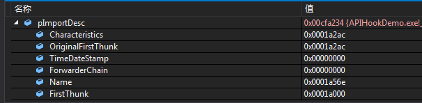
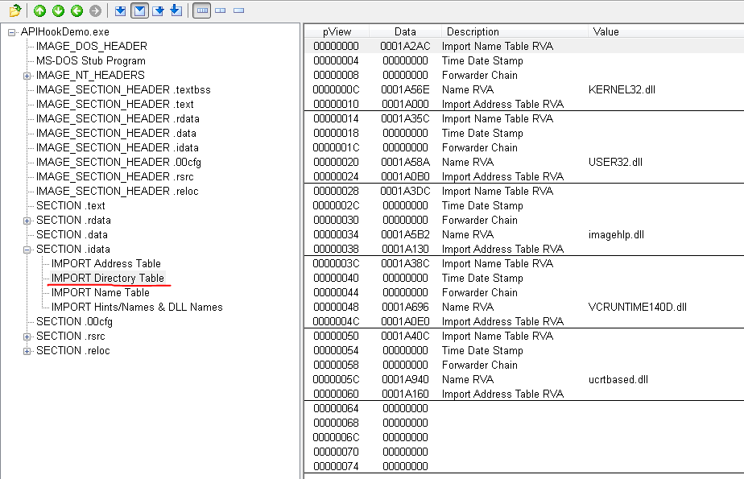
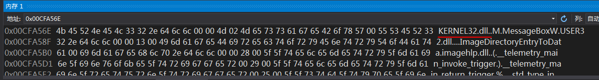

# APIHookDemo

## `ReplaceIATEntryInOneMod` 分析

本例中，`hModCaller`是模块`APIHookDemo.exe`的加载基地址. 接着使用`ImageDirectoryEntryToData`获取模块的导入表描述符数组,

返回结果如下：

使用PEView查看磁盘文件：

`pImportDesc->Name`即模块名字符串相对模块加载基地址的偏移(Name RVA)，在内存窗体输入`hModCaller+pImportDesc->Name`的数值即可查看：

遍历导入表描述符数组，找到与`pszModName`匹配的项后，定位到该模块的IAT. IAT存放了导入函数的入口地址，由于导入函数来自DLL，而加载DLL过程可能发生重定位，因此IAT只能在模块加载后填充.

接着遍历模块的IAT，找到IAT里需要被Hook的函数对应的槽位后，替换为`pfnNew`. 至此，IAT替换完成.