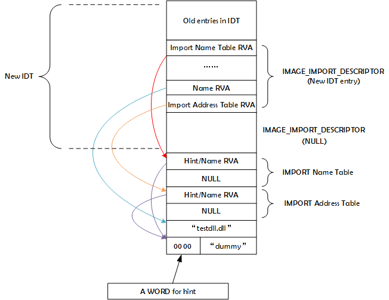

# 通过修改PE文件实现DLL注入
## 整体设计
1. 将原来的`IDT`拷贝到最后一个节的末尾
2. 在新的IDT末尾为目标DLL添加一个`IMAGE_IMPORT_DIRECTORY`结构体
3. 在新的IDT后面依次放置目标DLL的`INT`、`IAT`、目标DLL的文件名、一个`WORD`(两个字节)的`Hint`和目标DLL的导出函数的名字（目标DLL必须至少有一个导出函数，否则这个DLL不会被加载）
4. 上述所有数据附加到最后一个节的末尾，结构如下：

