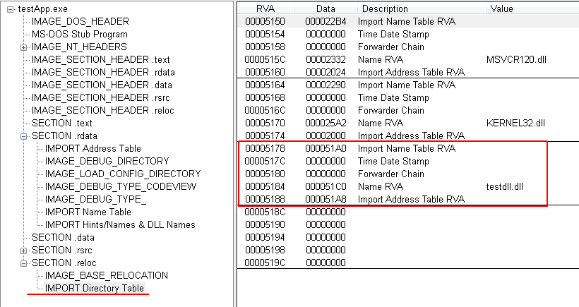
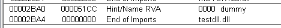
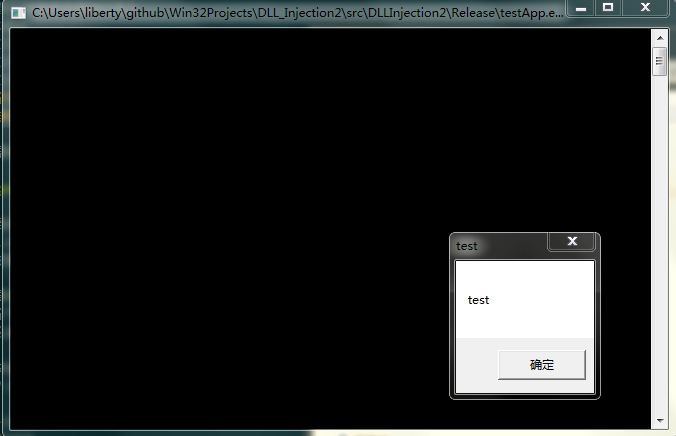
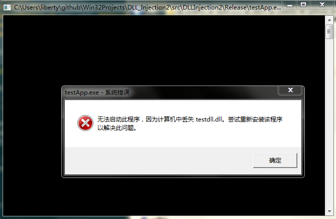

# 通过修改PE文件实现DLL注入
## 整体设计
1. 将旧`IDT`拷贝到新的地方
2. 在新`IDT`末尾为目标DLL添加一个`IMAGE_IMPORT_DIRECTORY`结构体
3. 在新`IDT`后面依次放置目标DLL的`INT`、`IAT`、目标DLL的文件名、一个`WORD`(两个字节)的`Hint`和目标DLL导出函数的名字（目标DLL至少要有一个导出函数，否则这个DLL不会被加载）
4. 解除绑定导入表，如果有的话

整个数据块结构如下：

在加载到内存中前，`IAT`中存放数据和`INT`是相同的，如上图所示；加载期间加载器会把函数实际地址填入`IAT`，此时`IAT`所在的节需要具有可写属性。(`IAT`一般存在于`.rdata`节，这个节是没有可写属性的，但为什么加载器填写`IAT`时不会报错？事实上，在`IMAGE_NT_HEADERS::IMAGE_OPTIONAL_HEADER`可以找到对应于`IAT`的数据项，所以加载器很有可能是据此定位到`IAT`，修改`IAT`所在内存页面为可写，保证后续的写入不会出错。)

现在需要在PE文件中找到存放上述数据块的地方，我选择最后一个节的空白区域(当然也可以放到最后一个节的末尾——即文件末尾)，这样不会增加文件大小，较为方便。每个节的实际数据长度`Virtual Size`和磁盘文件对齐长度`Size of Raw Data`之间通常会有一个差值，所以在磁盘文件上就会存在一段空白，如果这段空白区域足够大，那么就可以把上述数据块放进去。

把数据块放好后，需要修改`IMAGE_NT_HEADERS-IMAGE-OPTIONAL_HEADER`中对应于`IMPORT Table`的`RVA`和`Size`，使之指向新的`IDT`；修改最后一个节的`Virtual Size` ，并添加可写属性。

## 一个小细节
### 定位IDT
`IMAGE_NT_HEADERS::IMAGE_OPTIONAL_HEADER`对应于`IMPORT Table(即IDT)`的数据项内存放的是RVA需要将其转换成FileOffset方可成功定位。方法如下：

1. 遍历所有Section，判断`目标RVA`落在哪个Section
2. `目标RVA`减去Section的起始RVA，得到一个偏移量`RVA2`
3. `RVA2`加上Section的文件偏移`PointerToRawData`就得到`目标RVA`对应的FileOffset

## 实验结果
修改`testApp.exe`，注入`testdll.dll`，结果如下：

`IDT`成功被PEView识别！查看`IMPORT Address Table`可看到`testdll.dll`的导出函数`dummy`亦被成功识别：

执行修改后的`testApp.exe`，可以看到来自`testdll.DllMain`的弹窗：

如果把`testdll.dll`删去，就会提示DLL丢失：

