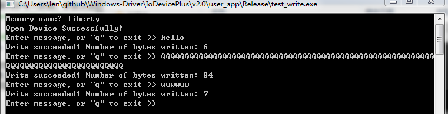
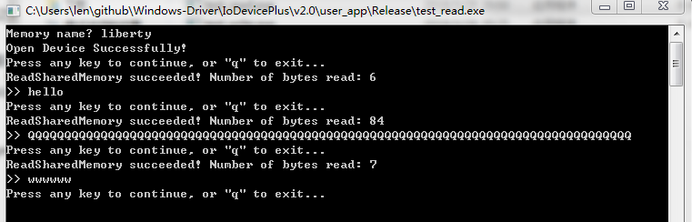

# 基于共享内存的进程通信机制 v2.0
## 内核模块设计
内核要做的工作包括接收并处理用户层程序的I/O请求，分配并管理共享内存.
### 一、接收并处理用户层程序的I/O请求
#### 1.生成控制设备
如果内核模块需要和应用程序通信，那么首先要生成一个设备对象(Device Object).设备对象是非常重要的元素。设备对象和分发函数构成了整个内核体系的基本框架。设备对可以在内核中暴露出来给应用层，应用层可以像操作文件一样操作它。


生成设备对象可以使用函数`IoCreateDevice`。函数原型如下：

```
NTSTATUS IoCreateDevice(
  _In_     PDRIVER_OBJECT  DriverObject,
  _In_     ULONG           DeviceExtensionSize,
  _In_opt_ PUNICODE_STRING DeviceName,
  _In_     DEVICE_TYPE     DeviceType,
  _In_     ULONG           DeviceCharacteristics,
  _In_     BOOLEAN         Exclusive,
  _Out_    PDEVICE_OBJECT  *DeviceObject
);
```

详细说明见MSDN文档[IoCreateDevice](https://docs.microsoft.com/en-us/windows-hardware/drivers/ddi/content/wdm/nf-wdm-iocreatedevice).

#### 2.控制设备的名字和符号链接
设备对象是可以有没名字的。但是控制设备需要有一个名字，这样它才会被暴露出来，工其他程序打开与之通信。设备的名字可以在调用`IoCreateDevice`时指定。此外，应用层是无法直接通过设备的名字来打开对象的，为此必须要建立一个暴露给应用层的**符号链接**。符号链接是记录一个字符串对应到另一个字符串的简单结构。生成符号链接的函数是：

```
NTSTATUS IoCreateSymbolicLink(
  _In_ PUNICODE_STRING SymbolicLinkName,
  _In_ PUNICODE_STRING DeviceName
);
```

详见MSDN文档[IoCreateSymbolicLink](https://docs.microsoft.com/en-us/windows-hardware/drivers/ddi/content/wdm/nf-wdm-iocreatesymboliclink)

#### 3.控制设备的删除
既然在驱动中生成了控制设备及其符号链接，那么在驱动卸载时就应该删除它们；否则符号链接就会一直存在。应用程序还可能会尝试打开进行操作。删除设备对象和符号链接的函数如下：

```
VOID IoDeleteDevice(
  _In_ PDEVICE_OBJECT DeviceObject
);
```

```
NTSTATUS IoDeleteSymbolicLink(
  _In_ PUNICODE_STRING SymbolicLinkName
);
```

#### 4.分发函数
分发函数是一组用来处理发送给设备对象的请求的函数。这些函数有内核驱动的开发者编写，以便处理这些请求并返回给Windows。分发函数是设置在驱动对象(Driver Object)上的。即，每个驱动都有一组自己的分发函数。Windows的IO管理器在收到请求时，会根据请求发送的目标，也就是一个设备对象，来调用这个设备对象所从属的驱动对象上的对应的分发函数。

不同的分发函数处理不同的请求。当然，开发者也可以将所有的请求都由一个分发函数来处理，只是在分发函数中自己区别各种请求即可。请求有许多中，但本例的内核模块只用到三种请求：

- 打开(Create): 在试图访问一个设备堆型之前，必须先用打开请求“打开”它。只用得到成功的返回，才可以发送其他的请求。
- 关闭(Close): 在结束访问一个设备对象后，发送关闭请求关闭它。关闭之后，就必须再次打开才能访问。
- 设备控制(Device Control): 设备控制是一种既可以用来输入（从应用到内核），又可以用来输出（从内核到应用）的请求。

一个标准的分发函数原型如下：

```
NTSTATUS DispatchRoutine(PDEVICE_OBJECT pDeviceObject, PIRP pIrp);
``` 

其中`pDeviceObject`是请求要发送给的目标对象；`pIrp`则是代表请求内容的数据结构指针。无论如何，分发函数必须首先设置给驱动对象，这个工作在`DriverEntry`中完成.  `IoDevicePlus.c`中相关代码片段如下：

```
for (ULONG i = 0; i < IRP_MJ_MAXIMUM_FUNCTION; i++)
	{
		pDriverObject->MajorFunction[i] = DispatchRoutine;
	}
```

#### 5.请求的处理
在分发函数中处理请求的第一步是获得请求的当前栈空间（Current Stack Location）。请求的栈空间结构是适应于Windows内核驱动中设备对象的栈结构的，但是这不是重点，我编写的内核模块仅仅利用当前栈空间指针来获得主功能好。每种请求都用一个主功能号来说明这是一个什么请求。

- 打开请求的主功能号是`IRP_MJ_CREATE`.
- 关闭请求的主功能号是`IRP_MJ_CLOSE`.
- 设备控制请求的主功能号是`IRP_MJ_DEVICE_CONTROL`.

请求的当前栈空间可以用`IoGetCurrentIrpStackLocation`取得，然后根据主功能号做不同的处理.`IoGetCurrentIrpStackLocation`函数原型如下：

```
PIO_STACK_LOCATION IoGetCurrentIrpStackLocation(
  _In_ PIRP Irp
);
```

代码框架如下：

```
NTSTATUS DispatchRoutine(PDEVICE_OBJECT pDeviceObject, PIRP pIrp)
{
	NTSTATUS Status = STATUS_SUCCESS;

	......	

	// Use stack location of current I/O request to get major function code.
	PIO_STACK_LOCATION pIrpStack = IoGetCurrentIrpStackLocation(pIrp);

	// Is the request sent to our device object?
	if (pDeviceObject == g_pDeviceObject)
	{
		if ((pIrpStack->MajorFunction == IRP_MJ_CREATE) ||
			(pIrpStack->MajorFunction == IRP_MJ_CLOSE))
		{
			// `Create` and `Close` always succeed.
			// TODO nothing
		}
		else if (pIrpStack->MajorFunction == IRP_MJ_DEVICE_CONTROL)
		{
			......

			switch (pIrpStack->Parameters.DeviceIoControl.IoControlCode)
			{
			case DEVICE_SEND_DATA:
				
				......

				break;
			case DEVICE_RECV_DATA:

				......
				
				break;
			case DEVICE_MEM_ALLOC:

				......

				break;
			case DEVICE_MEM_FREE:

				......

				break;
			case DEVICE_OPEN_MEM:
				
				......

				break;
			default:
				......
				break;
			}
		}
	}

	
	pIrp->IoStatus.Information = Retval; // How many bytes are returned to user app?
	pIrp->IoStatus.Status = Status; // status when I/O request completes
	IoCompleteRequest(pIrp, IO_NO_INCREMENT); // Complete I/O request

	return Status;
}
```

在分发函数中返回请求，需要以下四步：

```
	pIrp->IoStatus.Information = Retval; // How many bytes are returned to user app?
	pIrp->IoStatus.Status = Status; // status when I/O request completes
	IoCompleteRequest(pIrp, IO_NO_INCREMENT); // Complete I/O request

	return Status;
```

- 设置`pIrp->IoStatus.Information`主要用于告知应用程序本次请求中传输的字节数，当然还可以根据需要定义为其他信息。
- `pIrp->IoStatus.Status`用于记录本次请求的完成状态。这个和后面的分发函数的返回值是一样的，不过这只是一般情况，并不是所有的情况都一致。
- `IoCompleteRequest`用于结束这个请求.

### 二、应用方面的编程
#### 1.基本的功能需求
应用程序通过三个函数与内核中的设备对象进行通信：

- `CreateFile`打开设备对象，即发送打开请求。
- `CloseHandle`关闭设备对象，即发送关闭请求。
- `DeviceIoControl`发送不同的设备控制请求。

针对`CreateFile`最重要的第一个参数：一个用来表示设备的路径，它应该与内核模块生成的符号链接对应。

关闭设备则直接调用`CloseHandle`即可。

设备控制请求：

设备控制请求可以进行输入和输出。不论是输入还是输出都可以用一个自定义结构的长度缓冲区。设备请求功能号需要用Windows提供的`CTL_CODE`宏来生成。例如：

```
#define DEVICE_SEND_DATA \
	(ULONG)CTL_CODE(FILE_DEVICE_UNKNOWN, \
					0x900, \
					METHOD_BUFFERED, \
					FILE_WRITE_DATA)
```

`CTL_CODE`有4个参数，其中第一个参数是设备类型。我生成的这种控制设备和任何硬件都没有关系，所以直接定义成未知类型`FILE_DEVICE_UNKNOWN`即可。第二个参数是生成这个功能好的核心数字，这个数字直接用来和其他参数“合成”功能号。0x0~0x7ff被微软保留，所以我使用的数字从0x900开始。另外，这个数字不能大于0xfff。第三个参数`METHOD_BUFFERED`是说用缓冲方式。用缓冲方式的话，输入/输出缓冲会在应用和内核之间拷贝，这是比较简单和安全的一种方式。最后一个参数是这个操作需要的权限。当需要将数据发动到设备时，相当于往设备上写入数据，所以标记为拥有写数据权限`FILE_WRITE_DATA`；如果需要从设备接收数据，则需要标记为用于读数据权限`FILE_READ_DATA`.

一个简单的调用`DeviceIoControl`发送控制请求的代码如下：

```
if (0 != DeviceIoControl(g_hDevice, DEVICE_SEND_DATA, _pBuffer, _nSize,
    NULL, 0, pBytesWritten, NULL))
{
    return TRUE;
}
```

事实上这是极其危险的做法，等于在内核中敞开了一个不限长度的缓冲区用以进行攻击，所以必须在内核中进行必要的安全检查。`DeviceIoControl`会导致内核中的设备对象收到一个控制设备请求。

### 三、核心设计
上文给出了基本的内核与应用借助设备对象进行通信的框架，下面讨论本工程项目的核心设计：**在内核中分配共享内存，实现类似于管道的进行通信机制，并提供应用程序编程接口(API)**.

#### 1.应用程序接口的设计
我在`ioctl.h`中定义了所需的全部API:

```
/**
 * @param	pszName		The unique name of "shared memory".
 * 
 * @return	A handle to "shared memory".
 */
HANDLE OpenSharedMemory(PSTR pszName);


/**
 * @param	pszName		The unique name of "shared memory".
 * @param	uSize		The length of "shared memory", in bytes.
 *
 * @return	A handle of "shared memory" you create 	
 */
HANDLE CreateSharedMemory(PSTR pszName, DWORD uSize);


/**
 * @param	hMemory		A handle to "shared memory".
 * @param	pBuffer		A pointer to the buffer that receives the data read from "shared memory".
 * @param	nSize		The maximum number of bytes to be read.
 * @param	pBytesRead	A pointer to the variable that receives the number of bytes read.
 *
 * @return	If the functions succeeds, the return value is TRUE, or FALSE otherwise.
 */
BOOL ReadSharedMemory(HANDLE hMemory, PVOID pBuffer, DWORD nSize, PDWORD pBytesRead);


/**
 * @param	hMemory		A handle to "shared memory".
 * @param	pBuffer		A pointer to the buffer containing the data to be written to "shared memory".
 * @param	nSize		The number of bytes to be written.	
 * @param	pBytesRead	A pointer to the variable that receives the number of bytes written.
 *
 * @return	If the functions succeeds, the return value is TRUE, or FALSE otherwise.
 */
BOOL WriteSharedMemory(HANDLE hMemory, PVOID pBuffer, DWORD nSize, PDWORD pBytesWritten);


/**
 * @param	hMemory		A handle to "shared memory".
 */
VOID FreeSharedMemory(HANDLE hMemory);
```

- `HANDLE OpenSharedMemory(PSTR pszName);` 打开`pszName`指定的共享内存，返回该共享内存的句柄。这里我模仿了Windows的命名管道，即使用字符串标识一段共享内存。
- `HANDLE CreateSharedMemory(PSTR pszName, DWORD uSize);` 创建名为`pszName`的大小为`uSize`的共享内存，返回该共享内存的句柄。
- `BOOL ReadSharedMemory(HANDLE hMemory, PVOID pBuffer, DWORD nSize, PDWORD pBytesRead);` 读取共享内存的数据。参数及返回值说明见注释。
- `BOOL WriteSharedMemory(HANDLE hMemory, PVOID pBuffer, DWORD nSize, PDWORD pBytesWritten);` 向共享内存写入数据。参数及返回值说明见注释。
- `VOID FreeSharedMemory(HANDLE hMemory);` 释放`hMemory`句柄指定的共享内存。

这4个函数实现在`ioctl.cpp`中，主要用到的就是之前提到的`CreateFile`、`DeviceIoControl`和`CloseHandle`3个函数。

使用这些API编写的通信测试程序是`test_read`(客户端程序，读取共享内存数据)和`test_write`(服务端程序，申请共享内存，写入数据到共享内存，并负责释放共享内存). 这两个程序已编译为Release版本，所以应该能在没有安装Visual Studio 2013的Win7及以上操作系统上运行。

**测试结果如下:**

`test_write`申请创建指定名字的共享内存并将用户输入的数据写入共享内存，以便`test_read`读取：



`test_read`打开`test_write`申请的共享内存，并读取共享内存的数据:



**此外需要说明的是，我编写的内核模块`IoDevicePlus.sys`支持多对这样的C/S架构的应用程序进行通信，各组应用程序使用的共享内存由`IoDevicePlus.sys`同一管理而不会发生冲突。**

#### 2.内核模块的设计
之前已给出了在内核中处理设备对象的控制请求的代码框架。主体部分显然是分发函数中对不同请求的处理。

##### (1) 请求的管理

首先，我用`CTL_CODE`定义了一组功能号:

```
#define DEVICE_SEND_DATA \
	(ULONG)CTL_CODE(FILE_DEVICE_UNKNOWN, \
					0x900, \
					METHOD_BUFFERED, \
					FILE_WRITE_DATA)

#define DEVICE_RECV_DATA \
	(ULONG)CTL_CODE(FILE_DEVICE_UNKNOWN, \
					0x901, \
					METHOD_BUFFERED, \
					FILE_READ_DATA | FILE_WRITE_DATA)

#define DEVICE_MEM_ALLOC \
	(ULONG)CTL_CODE(FILE_DEVICE_UNKNOWN, \
					0x902, \
					METHOD_BUFFERED, \
					FILE_WRITE_DATA)

#define DEVICE_MEM_FREE \
	(ULONG)CTL_CODE(FILE_DEVICE_UNKNOWN, \
					0x903, \
					METHOD_BUFFERED, \
					FILE_WRITE_DATA)

#define DEVICE_OPEN_MEM \
	(ULONG)CTL_CODE(FILE_DEVICE_UNKNOWN, \
					0x904, \
					METHOD_BUFFERED, \
					FILE_WRITE_DATA)
```

下面逐一说明：
- `DEVICE_SEND_DATA` 应用程序将数据通过缓冲区发送给内核。该功能号用于`WriteSharedMemory`将数据写入共享内存。
- `DEVICE_RECV_DATA` 应用程序接收内核发送的数据。该功能号用于`ReadSharedMemory`从共享内存读取数据。
- `DEVICE_MEM_ALLOC` `CreateSharedMemory`申请创建共享内存时使用该功能号，内核据此完成内存分配。
- `DEVICE_MEM_FREE` `FreeSharedMemory`申请释放共享内存时使用该功能号，内核收到请求后释放相应的内存。
- `DEVICE_OPEN_MEM` `OpenSharedMemory`申请"打开"共享内存时使用该功能号，内核收到请求后将相应的共享内存的“句柄”返回给应用程序。

至于如何管理共享内存，我设计了一个结构体：

```
typedef struct _MEMORY_TABLE {
	LIST_ENTRY	ListEntry;
	CHAR		Name[MEM_NAME_LEN];
	PVOID		MemBase; // memory base of allocation
	DWORD32		MemLength; // memory length of allocaion
	DWORD32		AvailableLength; // available length of allocated memory
} MEMORY_TABLE, *PMEMORY_TABLE;
```

`Name`就是应用程序指定的共享内存的名字。各个成员的含义是显然的，唯一需要说明的是`ListEntry`。使用`LIST_ENTRY`是为了使用链表的形式管理各个结构体。链表节点上的每一个`MEMORY_TABLE`结构体都由一对唯一的C/S架构应用程序与之对应。每当有应用程序申请共享内存时，内核就会生成一个对应的`MWMORY_TABLE`结构体并将其加入链表。

**在链表中使用自旋锁：**
既然需要使用链表，就不得不考虑多线程安全性。

由于本工程中需要将链表定义为全局变量，所以如果有多个线程同时操作链表而不对链表的操作加锁的话，链表将被损坏。为了解决这个问题，可以直接使用Windows提供的**自旋锁**，从而实现链表操作的多线程安全。

要在内核模块中使用自旋锁，首先需要定义一个全局自旋锁变量：

```
KSPIN_LOCK		g_ListLock;
```

然后初始化自旋锁：

```
KeInitializeSpinLock(&g_ListLock);
```

此后就可以利用该自旋锁对链表进行加锁访问：

在链表头部添加一个节点，使用`ExInterlockedInsertHeadList`函数：

```
PLIST_ENTRY ExInterlockedInsertHeadList(
  _Inout_ PLIST_ENTRY ListHead,
  _Inout_ PLIST_ENTRY ListEntry,
  _Inout_ PKSPIN_LOCK Lock
);
```

但是从链表中移除一个节点并没有相应的加锁函数，所以使用`RemoveEntryList`：

```
BOOLEAN RemoveEntryList(
  _In_ PLIST_ENTRY Entry
);
```

此时为了给链表加上自旋锁只能使用`KeAcquireSpinLock`和`KeReleaseSpinLock`，代码如下:

```
KIRQL irql;
KeAcquireSpinLock(&g_ListLock, &irql);
RemoveEntryList(...);
KeReleaseSpinLock(&g_ListLock, irql);
```

`KeAcquireSpinLock`和`KeReleaseSpinLock`之间的代码加锁执行。`KIRQL`是中断级别。`KeAcquireSpinLock`会提高当前中断级别，并将旧的中断级别保存在这个参数中。

##### (2) 具体功能的实现

- `DEVICE_MEM_ALLOC` 该功能由`CreateSharedMemory`发出，用以申请一定长度的共享内存。

```
case DEVICE_MEM_ALLOC:
				......
				/**
                 * `CreateSharedMemory`将所需共享内存的长度放在缓冲区首部，这是一个
                 * 4字节的无符号整数。因此首先将其从缓冲区提取出来.
                 */
				DWORD32 cb = *(DWORD32 *)pUserBuffer;

				/**
                 * 缓冲区偏移4字节以后的数据是用户调用`CreateSharedMemory`时提供的
                 * 一个字符串，该字符串可以标识一段共享内存.
                 */
				PSTR pszName = (PSTR)pUserBuffer + sizeof(DWORD32);

				/**
                 * 不同应用申请的共享内存不能同名，所以在正式分配之前，需要确认链表中
                 * 不含`pszName`指定的共享内存。否则返回错误。
                 */
				if (FindMemoryEntry(pszName))
				{
					// MEMORY_TABLE entry named as `pszName` has
					// already been created.
					KdPrint(("Name \"%s\" is invalid\n", pszName));
					Status = STATUS_INVALID_PARAMETER;
					break;
				}
				/**
                 * 分配链表节点
                 */
				// Allocate list entry.
				pMemTbl = (PMEMORY_TABLE)ExAllocatePoolWithTag(
					NonPagedPoolNx, sizeof(MEMORY_TABLE), MEM_TAG);
				if (pMemTbl != NULL)
				{
                	/××
                     × 分配共享内存
                     ×/
					// Allocate shared memory.
					pMemTbl->MemBase = ExAllocatePoolWithTag(
						NonPagedPoolNx, cb, MEM_TAG);
					if (pMemTbl->MemBase != NULL)
					{
                    	/**
                         * 填充链表节点，填入必要的信息。包括：
                         * 已分配的内存长度；
                         * 可用的内存长度（即包含有效数据的内存长度)
                         * 内存的标识字符串
						 *
						 * 注意，在将字符串从缓冲区拷贝进`pMemTbl->Name`时，必须
						 * 检查字符串长度，并使用`strncpy`而不是`strcpy`，否则存在
						 * 缓冲区溢出漏洞。
                         */
						if (strlen(pszName) < MEM_NAME_LEN)
						{
							pMemTbl->MemLength = cb;
							pMemTbl->AvailableLength = 0;
							strncpy(pMemTbl->Name, pszName, MEM_NAME_LEN);
							
                            /* 将已分配的内存区域清零 */
							RtlZeroMemory(pMemTbl->MemBase, pMemTbl->MemLength);
							/* 将节点加锁地添加进链表 */
							ExInterlockedInsertHeadList(&g_ListHead, 
								(PLIST_ENTRY)pMemTbl, &g_ListLock);

							/**
                             * 将已分配的共享内存的虚拟地址返回给用户，作为共享内存的"句柄“
                             */
							// The "handle" of allocated shared memory.
							Retval = (ULONG)pMemTbl;
						}
						else // The name is too long, invalid.
						{
							......
						}
					}
					else
					{
						......
					}
				}
				else
				{
                	......
				}
```

- `DEVICE_SEND_DATA` 该功能号由`WriteSharedMemory`发出，用以将数据通过缓冲区写入分配好的共享内存

```
case DEVICE_SEND_DATA:
				......
				//
				// Server writes data to shared memory.
				//

				// A DWORD32 at the beginning of `pUserBuffer` is a "handle"
				// specified the unique entry of MEMORY_TABLE in the linked list.
				DWORD32 BytesToWrite = InputLength - sizeof(DWORD32);

				pMemTbl = (PMEMORY_TABLE)(*(DWORD32 *)pUserBuffer);
				if (pMemTbl && pMemTbl->MemBase)
				{
					if (ContainMemoryEntry(pMemTbl))
					{
						RtlZeroMemory(pMemTbl->MemBase, pMemTbl->MemLength);
						if (BytesToWrite <= pMemTbl->MemLength)
						{
							PCHAR pSrc = (PCHAR)pUserBuffer + sizeof(DWORD32);
							RtlCopyMemory(pMemTbl->MemBase, pSrc, BytesToWrite);

							pMemTbl->AvailableLength = BytesToWrite;
							Retval = BytesToWrite;
						}
						else
						{
							KdPrint(("Buffer length out of range\n"));
							Status = STATUS_INVALID_PARAMETER;
						}
					}
					else
					{
						KdPrint(("Shared memory broken\n"));
						Status = STATUS_INVALID_PARAMETER;
					}
				}
				else
				{
					KdPrint(("Invalid handle to shared memory\n"));
					Status = STATUS_INVALID_PARAMETER;
				}
```

- `DEVICE_RECV_DATA` 该功能号由`ReadSharedMemory`发出，用以通过缓存区从共享内存读入数据

```
case DEVICE_RECV_DATA:
                ......

				// Copy data from "shared memory".
				// NOTE: The number of bytes which client can read from shared memory
				//		 shouldn't go beyond `MEMORY_TABLE::AvailableLength`.

				// `pUserBuffer` is used as both input and output.

                /**
                 * 应用程序调用`ReadSharedMemory`时，将共享内存的句柄放在缓冲区开头4字节。
                 * 共享内存的句柄实质上是链表中的一个节点在内核空间内的虚拟地址，通过它内核可
                 * 以直接访问相应的`MEMORY_TABLE`结构体。但在使用句柄前，必须检查地址的合法性。
                 * 从缓冲区提取句柄时，将`pUserBuffer`用作输入缓冲区。
                 */
				// `pUserBuffer` as input buffer.
				pMemTbl = (PMEMORY_TABLE)(*(DWORD32 *)pUserBuffer);
				if (pMemTbl && pMemTbl->MemBase)
				{
                	/**
                     * 链表中是否存在`pMemTbl`指定的节点？
                     */
					if (ContainMemoryEntry(pMemTbl))
					{
						// Before using `pUserBuffer` as output buffer, we should zero it.
						RtlZeroMemory(pUserBuffer,
							(OutputLength < sizeof(DWORD32) ? sizeof(DWORD32) : OutputLength));
						/**
                         * 将数据拷贝到输出缓冲区时，必须检查`OutpurLength`，不能让应用程序
                         * 读取超过`长度pMemTbl->AvailableLength`的数据。
                         */
						if (OutputLength <= pMemTbl->AvailableLength)
						{
							RtlCopyMemory(pUserBuffer, pMemTbl->MemBase, OutputLength);
							Retval = OutputLength;
						}
						else
						{
							RtlCopyMemory(pUserBuffer, pMemTbl->MemBase, pMemTbl->AvailableLength);
							Retval = pMemTbl->AvailableLength;
						}
					}
					else
					{
						KdPrint(("Shared memory broken\n"));
						Status = STATUS_INVALID_PARAMETER;
					}
				}
				else
				{
					KdPrint(("Invalid handle to shared memory\n"));
					Status = STATUS_INVALID_PARAMETER;
				}
```

- `DEVICE_OPEN_MEM` 该功能号由`OpenSharedMemory`发出，用以获得共享内存的句柄，以便后续使用

```
case DEVICE_OPEN_MEM:
				//
				// User app (client or server) requests for the handle
				// of shared memory via its name.
				//
				/**
                 * 应用程序申请“打开”名为`szName`的共享内存，内核只需检索链表，
                 * 并将结果（节点的虚拟地址）返回即可
                 */
				CHAR szName[MEM_NAME_LEN];
				strncpy(szName, pUserBuffer, MEM_NAME_LEN);

				pMemTbl = FindMemoryEntry(szName);
				if (pMemTbl != NULL)
				{
					Retval = (ULONG)pMemTbl;
				}
				else
				{
					KdPrint(("No matched shared memory found\n"));
					Retval = (ULONG)NULL;
					Status = STATUS_INVALID_PARAMETER;
				}
```

- `DEVICE_MEM_FREE` 该功能号由`FreeSharedMemory`发出，用以在完成对共享内存的使用后，通知内核释放相关内存资源

```
case DEVICE_MEM_FREE:
				//
				// User app (client or server) requests to free its shared
				// memory entry in the list.
				//
                
                /**
                 * 应用程序请求释放共享内存，需要提供共享内存的句柄。
                 */

				pMemTbl = (PMEMORY_TABLE)(*(DWORD32 *)pUserBuffer);
				FreeMemoryEntry(pMemTbl);
```

释放共享内存的函数是:

```
BOOLEAN FreeMemoryEntry(PMEMORY_TABLE pMemTbl)
{
	BOOLEAN Flag = FALSE;
	if (pMemTbl && pMemTbl->MemBase)
	{
		PMEMORY_TABLE p = pMemTbl;

		// Free shared memory.
		ExFreePool(pMemTbl->MemBase);

		// Remove the entry from list.
		KIRQL irql;
		KeAcquireSpinLock(&g_ListLock, &irql);
		Flag = RemoveEntryList((PLIST_ENTRY)pMemTbl);
		KeReleaseSpinLock(&g_ListLock, irql);

		// Free the entry.
		ExFreePool(p);
	}
	return Flag;
}
```

`FreeMemoryEntry`首先检查地址的合法性，检查通过后先调用`ExFreePool`释放`pMemTbl->MemBase`指向的内存，再将相应的节点从链表中移除（注意，移除节点的操作必须加自旋锁来保证多线程安全），最后释放该节点所占内存，避免内存泄漏。

##### (3) 尾声
该内核模块加载后，一共创建了以下资源：

- IO设备对象
- 符号链接
- 申请的内存
	- 链表节点
	- 每个链表节点对应的共享内存

所有这些资源需要在模块被卸载时释放。这项工作由驱动卸载函数`UnloadDriver`完成：

```
VOID UnloadDriver(PDRIVER_OBJECT pDriverObject)
{
	// Delete symbolic link
	UNICODE_STRING SymLinkName =
		RTL_CONSTANT_STRING(DEVICE_SYMBOL_NAME);
	IoDeleteSymbolicLink(&SymLinkName);

	// Delete device
	if (g_pDeviceObject != NULL)
		IoDeleteDevice(g_pDeviceObject);
	
	// Free list
	FreeMemoryTableList();

	KdPrint(("UnloadDriver Success\n"));
}
```

`FreeMemoryTableList`遍历链表，对每一个节点调用`FreeMeoryEntry`，从未完成内存释放：

```
VOID FreeMemoryTableList()
{
	PLIST_ENTRY p;
	for (p = g_ListHead.Flink; p->Flink != &g_ListHead; p = p->Flink)
	{
		FreeMemoryEntry((PMEMORY_TABLE)p);
	}
}
```