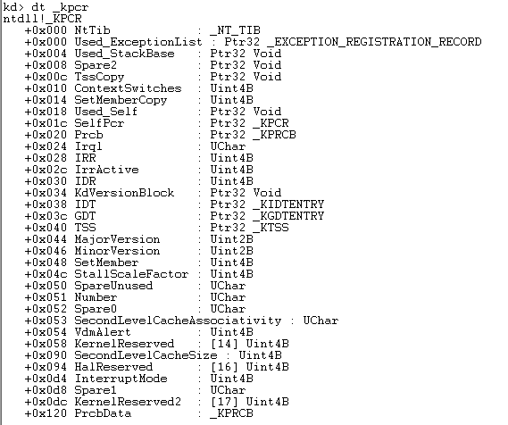
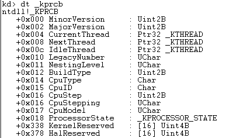
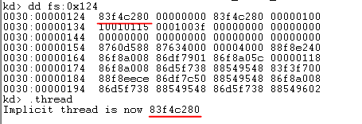
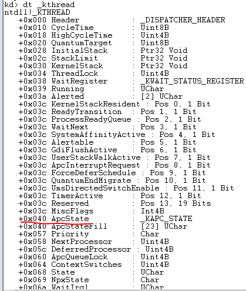
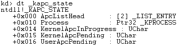
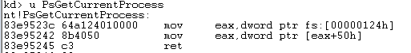
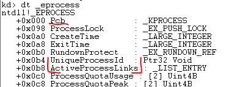
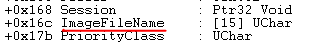
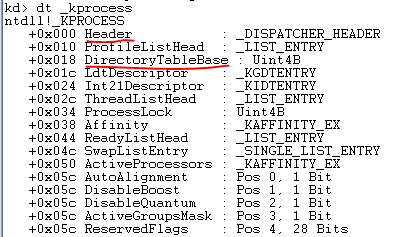

# ProcessHelper

## 遍历进程 EnumProcess()
Windows X86系列的RING0中，`fs:0`处存放的是**内核处理器控制区(_KPCR, Kernel's Processor Control Region)**. 在设置好内核符号表的WinDbg内可使用`dt _KPCR`命令查看结构体定义:

在`_KPRCR`偏移0x120处，接着存放着**_KPRCB**:

距离`_KPRCB`首部偏移0x004，是一个指向当前执行的线程结构体的指针，该指针相对`fs`段的偏移为0x124，因此`mov eax, fs:[0x124]`取得当前线程结构体首地址:

线程结构体`_KTHREAD`:

`_KTHREAD`偏移0x040是一个指向存放线程APC(Asynchronous Procedure Call，异步过程调用)状态信息的结构体的指针，结构体`_KAPC_STATE`：

所以，`mov eax, [eax + 0x40]`取得`_KAPC_STATE`结构体首址.

`_KAPC_STATE`偏移0x010处便是指向当前线程所属进程的`_EPROCESS`结构体的指针，`mov eax, [eax + 0x10]`取得当前进程`_EPROCESS`结构体首址.

**注意:** `_KTHREAD`偏移0x40的`ApcState`字段不是结构体指针，而是一个在`_KTHREAD`结构体中占据空间的`_KAPC_STATE`结构体，所以`_KTHREAD`结构体偏移0x40+0x10=0x50就是向当前线程所属进程的`_EPROCESS`结构体的指针. 这就是`PsGetCurrentProcess()`的实现原理:

`_EPROCESS`结构体：

开头的`_KPROCESS`结构体就是**进程控制块PCB**，`UniqueProcessId`便是是PID，`ImageFileName`是进程对应的可执行文件名，`ActiveProcessLinks`指向下一个进程的`_EPROCESS`结构体的`ActiveProcessLinks`，这是一个类似于循环链表的结构.

`_KPROCESS`结构体：

`DirectoryTableBase`是进程保存在`cr3`里的内容--页目录的物理地址.
