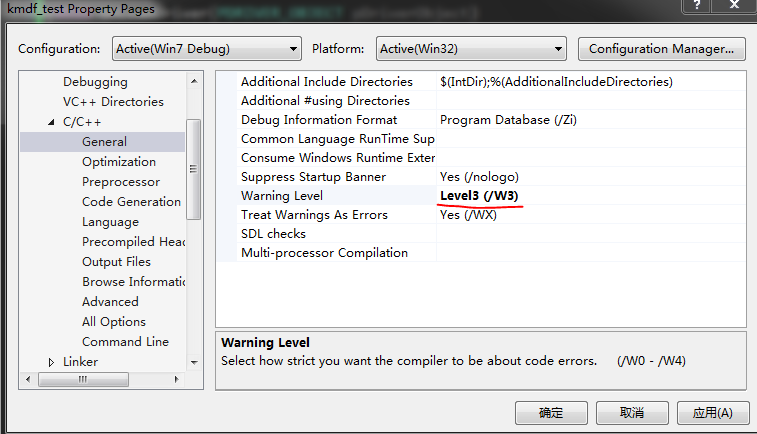
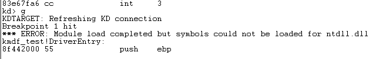

# vs2013+WDK8.1+VMware 驱动环境搭建
宿主机和目标机的OS均为`Windows 7 x86`

## Windows 7 x86 虚拟机配置
### 一、将`WDK8.1`下载的这个程序包安装到虚拟机里:

### 二、配置串口调试
- 1. 移除占用`com1`的"打印机"设备;
- 2. 添加`串行端口`，`输出到命名管道`，并进行如下设置

----------

----------

- 3. 添加虚拟机的内核调试模式

以管理员身份运行cmd，通过`bcdedit`设置启动项，主要用到的命令如下:

`bcdedit /copy {current} /d "Item_Name"`

`bcdedit /debug {标识符} on`

`bcdedit /bootdebug {标识符} on`

`bcdedit /dbgsettings serial baudrate:115200 debugport:1`

最终将启动项调整为:

选择`DebugEntry`即可进入内核调试模式，`Windows 7`正常启动.

----------

- 4. 测试`WinDbg`和虚拟机的连接

在`WDK8.1`安装目录下(`C:\Program Files\Windows Kits\8.1\Debuggers\x86`)找到`windbg.exe`，创建快捷方式并右键编辑属性:

在`目标(T)`的引号后面添加` -b -k com:port=\\.\pipe\com_1,baud=115200,pipe`，如图:

以启动项`DebugEntry`启动虚拟机后，系统黑屏无响应，此时双击设置好的`windbg`快捷方式，若连接成功，WinDbg将在`int 3`处中断. 此后持续键入命令`g`即可让系统正常启动.

## 驱动配置与部署
### vs2013
#### 基础配置
新建`Kernel Mode Driver, Empty (KMDF)`工程. 解决方案中有2个工程，`Package`负责在目标机上安装部署驱动模块.

设置`kmdf_test`项目的属性:

- 关闭驱动签名:

- 关闭`Wpp Tracing`

- 适当降低警告等级

完成上述设置即可成功构建`kmdf_test`项目.

----------

#### 测试目标机配置
`DRIVER->Test-Configure Computer...`

关键配置如下:

> `Computer name`是虚拟机的计算机名，不是真机的.

----------

----------

输入虚拟机登陆口令：

等待vs2013在虚拟机上完成配置:

#### `kmdf_test Package`属性设置

----------

> 如果`Run InfCat`为`No`，将不会生成安全证书.cer文件，后续部署时会出错.

> `Use Local Time`如果未选中，有时会出现认证错误.

#### 构建解决方案，vs2013将完成驱动模块在虚拟机里的安装部署
成功后，即可在目标机中看到安装好的驱动模块:

----------

## 驱动调试
- 以`DebugEntry`启动虚拟机，并启动WinDbg，WinDbg成功中断后，设置符号文件路径，WinDbg能在该路径下找到`*.pdb`文件.

- 在WinDbg首次在`int 3`处中断目标机时，如果使用`lm`命令查看已加载模块，会发现只有`winload.exe`，此时键入命令`bp kmdf_test!DriverEntry`下断点，将出现如下提示:

- 继续使用`g`命令，最终将成功命中断点：

- 再次`lm`列出已加载模块，即可看到我的驱动模块:

- 打开源码文件后即可进行源码级调试:

为了能在控制台看到`KdPrint`的输出，需要修改虚拟机的注册表:

### 设置WinDbg的内核符号表
`File->Symbol File Path`，添加`srv*e:\Windows Kernel Symbols*http://msdl.microsoft.com/download/symbols`，勾选`reload`，`OK`，Windbg会将符号文件下载到指定目录下。

### 常用WinDbg调试命令
- `bp module_name!DriverEntry` 断点
- `bl` 查看所有断点
- `bc *` 清除所有断点
- `p`,`t` step over,step into
- `dv` 查看局部变量
- `r` 查看寄存器
- 查看内存 `dd, db`, 等 

## 常见错误
### 1. VS无法连接虚拟机
#### (1) 修复网络配置
- 主机：services.msc->启动VMware DHCP Service和VMware NAT Service
- 虚拟机网络配置选择NAT

#### (2) 修复管道
将串口设备移除后重新添加.

### 2.`Driver Deployment Task Failed: Default Driver Package Installation Task (possible reboot)`

解决方案：在`计算机管理->设备管理器->Samples`中找到该设备，卸载即可。注意*不要*勾选`删除此设备的驱动程序软件`!