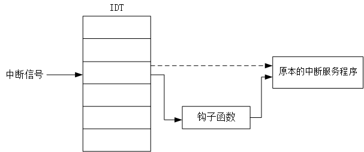
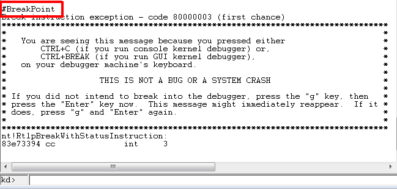
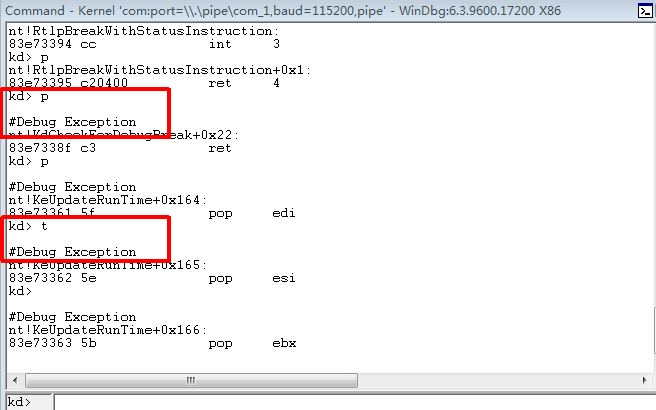
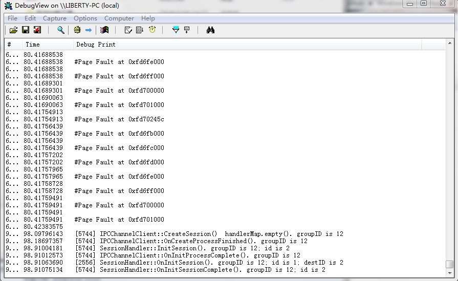

# 中断描述符表挂钩 (IDT Hook)

## 一、实现方法：
修改`IDT`表项，将钩子函数的地址填入*中断门*，并在钩子函数结束处跳转到原来的中断服务程序，保证中断正常相应. 执行流程如下：

****

## 二、测试结果：

### 1. 断点中断
目标机运行时，在WinDbg内将其中断：

### 2. 单步中断
在WinDbg内使用命令`t`和`p`单步执行：

## 3. 页面错误
在真机下加载驱动，通过`DebugView`查看输出，可以发现，`#PF`的频率极高：

