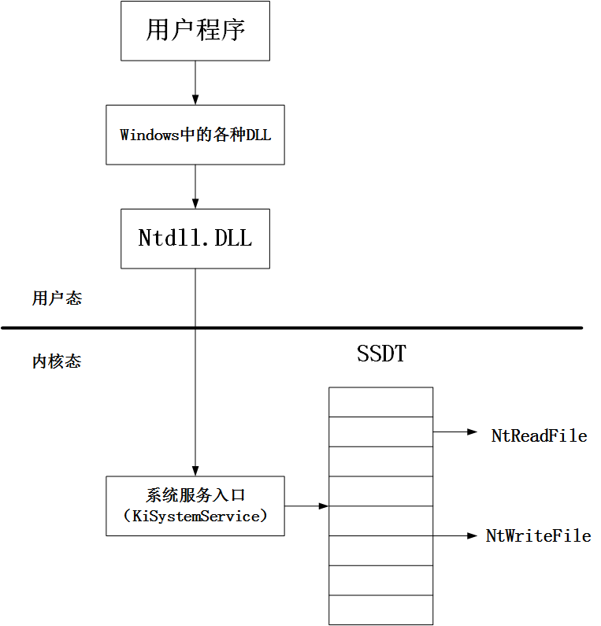
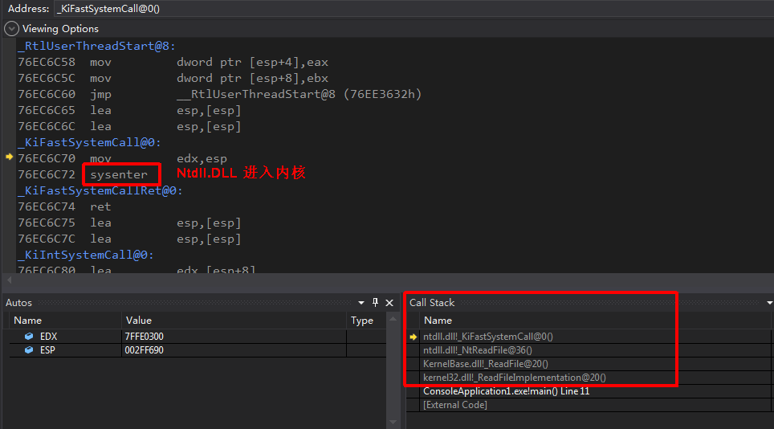
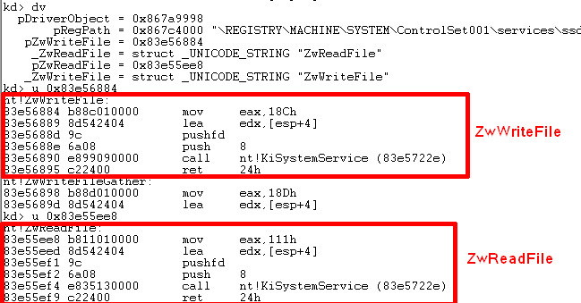
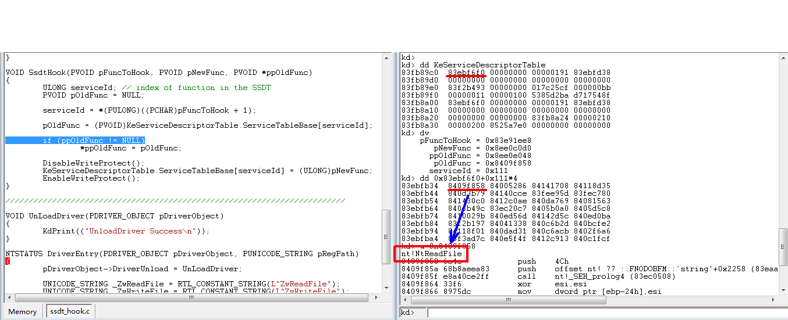
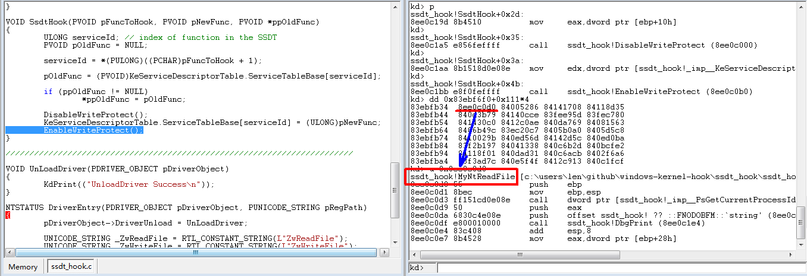
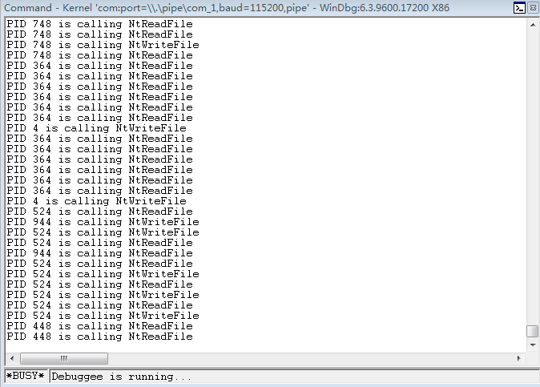

# 系统服务描述表挂钩(SSDT Hook)

## 一、Win32 API 调用过程

****

### 以`ReadFile`为例:
#### （一）用户态 -> 内核态
1. 用户程序调用`Kernel32.DLL`导出的`ReadFile`；
2. 最终调用`Ntdll.DLL`导出的`NtReadFile`，从而进入内核层.

在`Visual Studio`中跟踪上述过程：

**从`Call Stack`可以看到`kernel32.dll`到`ntdll.dll`的完整调用过程，最终`ntdll.dll`通过`sysenter`指令进入内核.**

**注意事项:**

**1.下断点的方法:** 在`ReadFile`断下来，将`GetProcAddress`取得的`ntdll.dll`导出的`NtReadFile`的地址输入反汇编窗口，并在入口处打断点；继续`F5`就可以命中`NtReadFile`，然后单步，最终得到上图的结果.

**2.符号加载:** 相应的pdb文件由WinDbg下载到其对应的目录下，在`Visual Studio`中添加并加载他们即可：`Tools->Options->Debugging->Symbols`.

**3.函数的区别:** 上面的`NtReadFile`由`ntdll.dll`导出，另外`ntdll.dll`还导出了另一个函数——`ZwReadFile`，他只是`NtReadFile`的别名；在内核中也有两个同名函数，由内核模块`nt`导出，他们和用户层的那两个不同.

****

#### （二）内核中的处理过程
1. 进入内核后，最终会调用`nt!ZwReadFile`（`sysenter`指令进入内核的过程不易跟踪，跳过之）.
2. `nt!ZwReadFile`将*系统服务编号*传入`EAX`后，调用`KiSystemService`，最终通过`SSDT`调用`nt!NtReadFile`，完成具体的逻辑功能.

****

## 二、SSDT Hook全过程
### 1. 获取待挂钩函数的*系统服务编号*:

从上图对`nt!ZwReadFile`的反汇编可知，*系统服务编号*就在函数入口的第一条指令的*立即数*域，将其读出来即可.

****

### 2. 修改`SSDT`表项之前，里面存放的确实是`nt!NtReadFile`的地址：

****

### 3. 修改后，相应的`SSDT`表项指向替代函数`MyNtReadFile`：

****

### 4. 至此，SSDT Hook 完成，效果如下:

